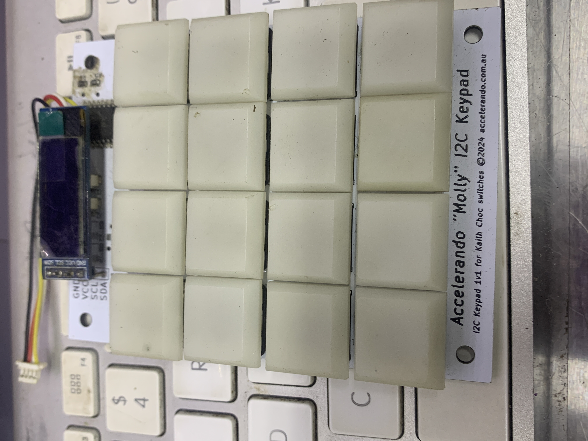

# Molly - an i2c keypad module

This is intended either to fit your existing microcontroller or be added to an off the
shelf microcontroller board to make  a standalone keypad (eg the TTGO T7-S3 is a good choice of board).

Theres some simple python code in here, but
you should probably consider the [ZMK firmware](https://github.com/zmkfirmware/zmk) as the best starting point.

